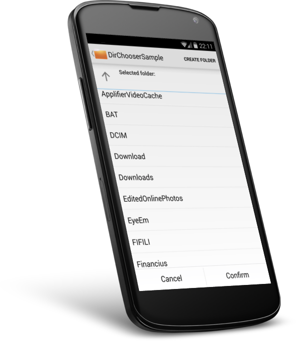
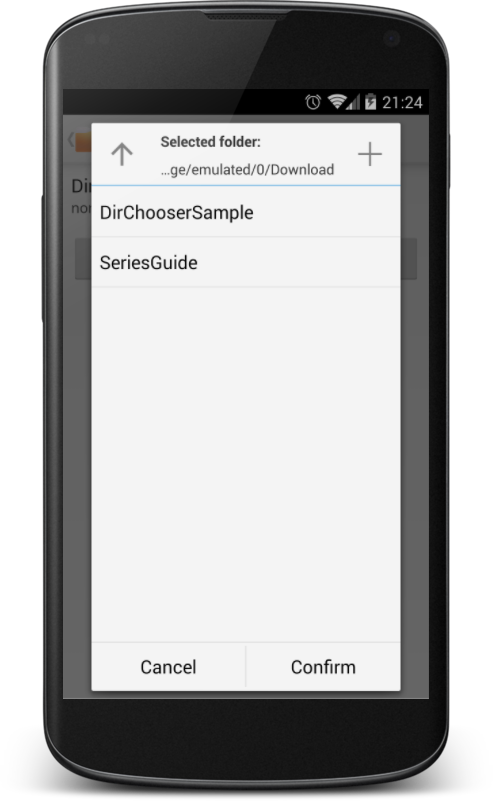

Android DirectoryChooser
========================

[](https://travis-ci.org/passy/Android-DirectoryChooser)

A simple directory chooser you can integrate into your Android app.

This version of the library has no additional dependencies, but requires Android
v11+ to work. There is, however, [a pre-v11-branch][3] that supports down to v7
using ActionBarSherlock.

You can download the sample app from the Play Store:

[][4]

Based on the DirectoryChooser from the excellent
[AntennaPod App](https://github.com/danieloeh/AntennaPod) by danieloeh.

<table>
<tr>
<th>As stand-alone Activity<br></th>
<th>As DialogFragment<br></th>
</tr>
</table>

Usage
-----

For a full example see the `sample` app in the
[repository](https://github.com/passy/Android-DirectoryChooser/tree/master/sample).

### Dependencies

Check out this repository and add it as a library project.

```console
$ git checkout https://github.com/passy/Android-DirectoryChooser.git
```

Import the project into your favorite IDE and add
`android.library.reference.1=/path/to/Android-DirectoryChooser/library` to your
`project.properties`.

#### Maven

Library releases are available on Maven Central, snapshots can be retrieved
from Sonatype:

*Release (SDK 11+)*

**Gradle**

```groovy
compile 'net.rdrei.android.dirchooser:library:2.1@aar'
```

**Maven**

```xml
<dependency>
  <groupId>net.rdrei.android.dirchooser</groupId>
  <artifactId>library</artifactId>
  <version>2.1</version>
  <type>aar</type>
</dependency>
```

*Release (SDK 7+)*

**Gradle**

```groovy
compile 'net.rdrei.android.dirchooser:library:1.0-pre-v11@aar'
```

**Maven**

```xml
<dependency>
  <groupId>net.rdrei.android.dirchooser</groupId>
  <artifactId>library</artifactId>
  <version>1.0-pre-v11</version>
  <type>aar</type>
</dependency>
```

*Snapshot (SDK 11+)*

```groovy
compile 'net.rdrei.android.dirchooser:library:2.1-SNAPSHOT@aar'
```

*Snapshot (SDK 4+)*

```groovy
compile 'net.rdrei.android.dirchooser:library:2.1-pre-v11-SNAPSHOT@aar'
```

### Manifest

You need to declare the `DirectoryChooserActivity` and request the
`android.permission.WRITE_EXTERNAL_STORAGE` permission.

```xml
<uses-permission android:name="android.permission.WRITE_EXTERNAL_STORAGE" />
...
<application>
    <activity android:name="net.rdrei.android.dirchooser.DirectoryChooserActivity" />
</application>
```

### Activity

To choose a directory, start the activity from your app logic:

```java
final Intent chooserIntent = new Intent(this, DirectoryChooserActivity.class);

// Optional: Allow users to create a new directory with a fixed name.
chooserIntent.putExtra(DirectoryChooserActivity.EXTRA_NEW_DIR_NAME,
                       "DirChooserSample");

// REQUEST_DIRECTORY is a constant integer to identify the request, e.g. 0
startActivityForResult(chooserIntent, REQUEST_DIRECTORY);
```

Handle the result in your `onActivityResult` method:

```java
@Override
protected void onActivityResult(int requestCode, int resultCode, Intent data) {
    super.onActivityResult(requestCode, resultCode, data);

    if (requestCode == REQUEST_DIRECTORY) {
        if (resultCode == DirectoryChooserActivity.RESULT_CODE_DIR_SELECTED) {
            handleDirectoryChoice(data
                .getStringExtra(DirectoryChooserActivity.RESULT_SELECTED_DIR));
        } else {
            // Nothing selected
        }
    }
}
```

### Fragment

You can also use the underlying DialogFragment for even better integration.
Whether you use the Fragment as a Dialog or not is completely up to you. All you
have to do is implement the `OnFragmentInteractionListener` interface to respond
to the events that a directory is selected or the user cancels the dialog:

```java
public class DirChooserFragmentSample extends Activity implements
    DirectoryChooserFragment.OnFragmentInteractionListener {

    private TextView mDirectoryTextView;
    private DirectoryChooserFragment mDialog;

    @Override
    protected void onCreate(Bundle savedInstanceState) {
        super.onCreate(savedInstanceState);
        setContentView(R.layout.dialog);
        mDialog = DirectoryChooserFragment.newInstance("DialogSample", null);

        mDirectoryTextView = (TextView) findViewById(R.id.textDirectory);

        findViewById(R.id.btnChoose)
                .setOnClickListener(new View.OnClickListener() {
                    @Override
                    public void onClick(View v) {
                        mDialog.show(getFragmentManager(), null);
                    }
                });
    }

    @Override
    public void onSelectDirectory(@Nonnull String path) {
        mDirectoryTextView.setText(path);
        mDialog.dismiss();
    }

    @Override
    public void onCancelChooser() {
        mDialog.dismiss();
    }
}

```

Apps using this
---------------

<table>
    <tr>
        <td>
            <a href="https://play.google.com/store/apps/details?id=net.rdrei.android.scdl2">
                
                <div>Downloader for SoundCloud</div>
            </a>
        </td>
        <td>
            <a href="https://play.google.com/store/apps/details?id=de.j4velin.wallpaperChanger">
                
                <div>Wallpaper Changer</div>
            </a>
        </td>
        <td>
            <a href="https://play.google.com/store/apps/details?id=com.xnview.XnRetro">
                
                <div>XnRetro</div>
            </a>
        </td>
        <td>
            <a href="https://play.google.com/store/apps/details?id=com.sleepcamel.gwhale">
                
                <div>GWhale</div>
            </a>
        </td>
        <td>
            <a href="https://play.google.com/store/apps/details?id=bml.prods.instasave">
                
                <div>InstaSave</div>
            </a>
        </td>
    </tr>
</table>

To add your own app, please send a pull request.

Releasing
---------

*Preparation*

To release a new snapshot on Maven Central, add your credentials to
`~/.gradle/gradle.properties` (you get them from http://oss.sonatype.org) as
well as your signing GPG key:

```
signing.keyId=0x18EEA4AF
signing.secretKeyRingFile=/home/pascal/.gnupg/secring.gpg

NEXUS_USERNAME=username
NEXUS_PASSWORD=password
```

*Staging*

To upload a new snapshot, just run gradle's `uploadArchives` command:

```
gradle :library:uploadArchives
```

*Release*

Update versions and remove `-SNAPSHOT` suffixes.

```
gradle build :library:uploadArchives
```

License
-------

```text
Copyright 2013 Pascal Hartig

Licensed under the Apache License, Version 2.0 (the "License");
you may not use this file except in compliance with the License.
You may obtain a copy of the License at

http://www.apache.org/licenses/LICENSE-2.0

Unless required by applicable law or agreed to in writing, software
distributed under the License is distributed on an "AS IS" BASIS,
WITHOUT WARRANTIES OR CONDITIONS OF ANY KIND, either express or implied.
See the License for the specific language governing permissions and
limitations under the License.
```

Thanks
------

Sample App icon by [Frank Souza](http://franksouza183.deviantart.com/).

 [1]: https://raw.github.com/passy/Android-DirectoryChooser/master/media/phone_screenshot_list.png
 [2]: https://raw.github.com/passy/Android-DirectoryChooser/master/media/phone_screenshot_dialog.png
 [3]: https://github.com/passy/Android-DirectoryChooser/tree/pre-v11
 [4]: https://play.google.com/store/apps/details?id=net.rdrei.android.dirchooser.sample
