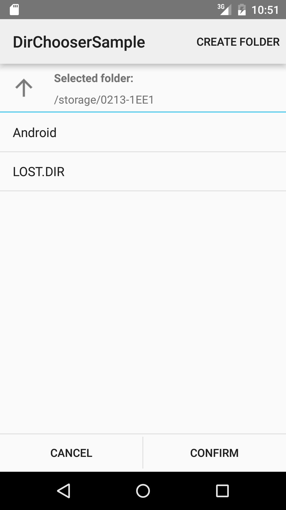
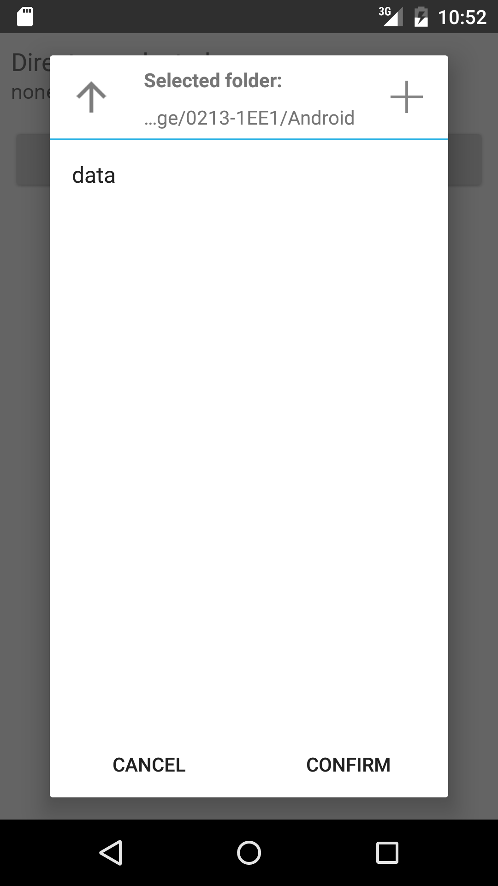

# Android DirectoryChooser

[](https://travis-ci.org/passy/Android-DirectoryChooser)
[](https://www.gittip.com/passy/)

[](http://waffle.io/passy/android-directorychooser)
[](http://android-arsenal.com/details/1/159)

A simple directory chooser you can integrate into your Android app.

This version of the library has no additional dependencies, but requires Android
v11+ to work. There is, however, [a pre-v11-branch][3] that supports down to v7
using ActionBarSherlock.

You can download the sample app from the Play Store:

<a href="https://play.google.com/store/apps/details?id=net.rdrei.android.dirchooser.sample"></a>

Based on the DirectoryChooser from the excellent
[AntennaPod App](https://github.com/danieloeh/AntennaPod) by danieloeh.

<table>
<tr>
<th>As stand-alone Activity<br></th>
<th>As DialogFragment<br></th>
</tr>
</table>

## Usage

For a full example see the `sample` app in the
[repository](https://github.com/passy/Android-DirectoryChooser/tree/master/sample).

### From Maven Central

Library releases are available on Maven Central, snapshots can be retrieved
from Sonatype:

*Release (SDK 11+)*

**Gradle**

```groovy
compile 'net.rdrei.android.dirchooser:library:3.2@aar'
```

**Maven**

```xml
<dependency>
  <groupId>net.rdrei.android.dirchooser</groupId>
  <artifactId>library</artifactId>
  <version>3.2</version>
  <type>aar</type>
</dependency>
```

*Release (SDK 7+)*

**Gradle**

```groovy
compile 'net.rdrei.android.dirchooser:library:1.0-pre-v11@aar'
```

**Maven**

```xml
<dependency>
  <groupId>net.rdrei.android.dirchooser</groupId>
  <artifactId>library</artifactId>
  <version>1.0-pre-v11</version>
  <type>aar</type>
</dependency>
```

*Snapshot (SDK 11+)*

```groovy
compile 'net.rdrei.android.dirchooser:library:3.2-SNAPSHOT@aar'
```

*Snapshot (SDK 4+)*

```groovy
compile 'net.rdrei.android.dirchooser:library:2.0-pre-v11-SNAPSHOT@aar'
```

### As Library Project

Alternatively, check out this repository and add it as a library project.

```console
$ git clone https://github.com/passy/Android-DirectoryChooser.git
```

Import the project into your favorite IDE and add
`android.library.reference.1=/path/to/Android-DirectoryChooser/library` to your
`project.properties`.

### Manifest

You need to declare the `DirectoryChooserActivity` and request the
`android.permission.WRITE_EXTERNAL_STORAGE` permission.

```xml
<uses-permission android:name="android.permission.WRITE_EXTERNAL_STORAGE" />
...
<application>
    <activity android:name="net.rdrei.android.dirchooser.DirectoryChooserActivity" />
</application>
```

### Activity

To choose a directory, start the activity from your app logic:

```java

final Intent chooserIntent = new Intent(this, DirectoryChooserActivity.class);

final DirectoryChooserConfig config = DirectoryChooserConfig.builder()
        .newDirectoryName("DirChooserSample")
        .allowReadOnlyDirectory(true)
        .allowNewDirectoryNameModification(true)
        .build();

chooserIntent.putExtra(DirectoryChooserActivity.EXTRA_CONFIG, config);

// REQUEST_DIRECTORY is a constant integer to identify the request, e.g. 0
startActivityForResult(chooserIntent, REQUEST_DIRECTORY);
```

Handle the result in your `onActivityResult` method:

```java
@Override
protected void onActivityResult(int requestCode, int resultCode, Intent data) {
    super.onActivityResult(requestCode, resultCode, data);

    if (requestCode == REQUEST_DIRECTORY) {
        if (resultCode == DirectoryChooserActivity.RESULT_CODE_DIR_SELECTED) {
            handleDirectoryChoice(data
                .getStringExtra(DirectoryChooserActivity.RESULT_SELECTED_DIR));
        } else {
            // Nothing selected
        }
    }
}
```

### Fragment

You can also use the underlying DialogFragment for even better integration.
Whether you use the Fragment as a Dialog or not is completely up to you. All you
have to do is implement the `OnFragmentInteractionListener` interface to respond
to the events that a directory is selected or the user cancels the dialog:

```java
public class DirChooserFragmentSample extends Activity implements
    DirectoryChooserFragment.OnFragmentInteractionListener {

    private TextView mDirectoryTextView;
    private DirectoryChooserFragment mDialog;

    @Override
    protected void onCreate(Bundle savedInstanceState) {
        super.onCreate(savedInstanceState);
        setContentView(R.layout.dialog);
        final DirectoryChooserConfig config = DirectoryChooserConfig.builder()
                .newDirectoryName("DialogSample")
                .build();
        mDialog = DirectoryChooserFragment.newInstance(config);

        mDirectoryTextView = (TextView) findViewById(R.id.textDirectory);

        findViewById(R.id.btnChoose)
                .setOnClickListener(new View.OnClickListener() {
                    @Override
                    public void onClick(View v) {
                        mDialog.show(getFragmentManager(), null);
                    }
                });
    }

    @Override
    public void onSelectDirectory(@NonNull String path) {
        mDirectoryTextView.setText(path);
        mDialog.dismiss();
    }

    @Override
    public void onCancelChooser() {
        mDialog.dismiss();
    }
}

```

If calling the directory chooser from your own fragment, be sure to set the target fragment first:

```java
@Override
public void onClick(View v) {
    mDialog.setTargetFragment(this, 0);
    mDialog.show(getFragmentManager(), null);
}
```

### Configuration

The Directory Chooser is configured through a parcelable configuration object, which is great
because it means that you don't have to tear your hair out over finicky string extras. Instead,
you get auto-completion and a nice immutable data structure. Here's what you can configure:

#### `newDirectoryName` : String (required)

Name of the directory to create. User can change this name when he creates the
folder. To avoid this use `allowNewDirectoryNameModification` argument.

#### `initialDirectory` : String (default: "")

Optional argument to define the path of the directory that will be shown first.
If it is not sent or if path denotes a non readable/writable directory or it is not a directory,
it defaults to `android.os.Environment#getExternalStorageDirectory()`.

#### `allowReadOnlyDirectory` : Boolean (default: false)

Argument to define whether or not the directory chooser allows read-only paths to be chosen. If it
false only directories with read-write access can be chosen.

#### `allowNewDirectoryNameModification` : Boolean (default: false)

Argument to define whether or not the directory chooser allows modification of provided new
directory name.

#### Example

```java
final DirectoryChooserConfig config = DirectoryChooserConfig.builder()
        .newDirectoryName("DialogSample")
        .allowNewDirectoryNameModification(true)
        .allowReadOnlyDirectory(true)
        .initialDirectory("/sdcard")
        .build();
```

## Apps using this

<table>
    <tr>
        <td>
            <a href="https://git.popcorntime.io/popcorntime/android">
                
                <div>Popcorn Time for Android</div>
            </a>
        </td>
        <td>
            <a href="https://play.google.com/store/apps/details?id=com.mb.android">
                
                <div>Emby for Android</div>
            </a>
        </td>
        <td>
            <a href="https://github.com/passy/scdl">
                
                <div>Downloader for SoundCloud</div>
            </a>
        </td>
        <td>
            <a href="https://play.google.com/store/apps/details?id=de.j4velin.wallpaperChanger">
                
                <div>Wallpaper Changer</div>
            </a>
        </td>
        <td>
            <a href="https://play.google.com/store/apps/details?id=com.xnview.XnRetro">
                
                <div>XnRetro</div>
            </a>
        </td>
        <td>
            <a href="https://play.google.com/store/apps/details?id=bml.prods.instasave">
                
                <div>InstaSave</div>
            </a>
        </td>
    </tr>
    <tr>
        <td>
            <a href="https://github.com/javiersantos/MLManager">
                
                <div>ML Manager</div>
            </a>
        </td>
        <td>
            <a href="https://play.google.com/store/apps/details?id=com.hovans.autoguard">
                
                <div>AutoGuard</div>
            </a>
        </td>
        <td>
            <a href="https://github.com/adithya321/Companion-for-Band">
                
                <div>Companion for Band</div>
            </a>
        </td>
        <td>
            <a href="https://github.com/sdabhi23/Swallow-Server">
                
                <div>Swallow Server</div>
            </a>
        </td>
        <td>
            <a href="https://play.google.com/store/apps/details?id=com.levionsoftware.instagram_map">
                
                <div>Photo Map</div>
            </a>
        </td>
    </tr>
</table>

To add your own app, please send a pull request.

## Releasing

*Preparation*

To release a new snapshot on Maven Central, add your credentials to
`~/.gradle/gradle.properties` (you get them from http://oss.sonatype.org) as
well as your signing GPG key:

```
signing.keyId=0x18EEA4AF
signing.secretKeyRingFile=/home/pascal/.gnupg/secring.gpg

NEXUS_USERNAME=username
NEXUS_PASSWORD=password
```

*Staging*

To upload a new snapshot, just run gradle's `uploadArchives` command:

```
gradle :library:uploadArchives
```

*Release*

Update versions and remove `-SNAPSHOT` suffixes.

```
gradle build :library:uploadArchives
```

## License

```text
Copyright 2013-2016 Pascal Hartig

Licensed under the Apache License, Version 2.0 (the "License");
you may not use this file except in compliance with the License.
You may obtain a copy of the License at

http://www.apache.org/licenses/LICENSE-2.0

Unless required by applicable law or agreed to in writing, software
distributed under the License is distributed on an "AS IS" BASIS,
WITHOUT WARRANTIES OR CONDITIONS OF ANY KIND, either express or implied.
See the License for the specific language governing permissions and
limitations under the License.
```

## Thanks

Sample App icon by [Frank Souza](http://franksouza183.deviantart.com/).

 [3]: https://github.com/passy/Android-DirectoryChooser/tree/pre-v11
 [4]: https://play.google.com/store/apps/details?id=net.rdrei.android.dirchooser.sample
